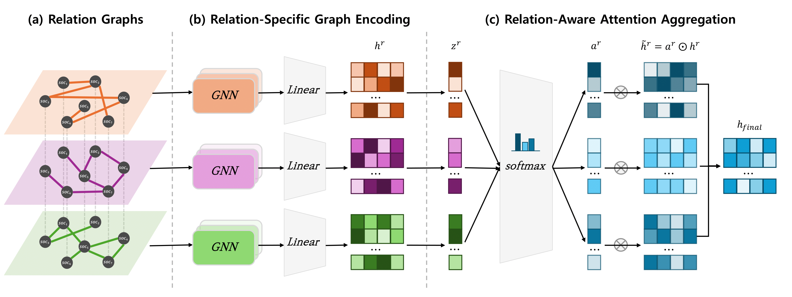

# RAM-GNN
Relation-Aware Multiplex Graph Neural Network


## Requirements & Setup
This codebase uses Python's built-in `venv` for managing dependencies instead of Conda.  
Please follow the steps below to set up the environment using `requirements.txt`.


### 1. **Install Python (>= 3.13.5)**  
Ensure Python 3.13.5 is installed. You can download it from the official site:  
[https://www.python.org/downloads/](https://www.python.org/downloads/)


### 2. **Clone the Repository**
Clone the repository using the following command:

```bash
git clone https://github.com/sybeam27/RAM-GNN.git
cd RAM-GNN
```

## Datasets
Below are the details and download links for datasets used in our experiments:

[Dataset details]

1. **O*NET** [(Download)](https://www.onetcenter.org/database.html#overview): O\*NET is a standardized U.S. Department of Labor database covering nearly 1,000 occupations. It provides detailed descriptors—skills, abilities, knowledge, work activities—based on hundreds of validated items in a content model.

2. **BLS (OES/OEWS)** [(Download)](https://www.bls.gov/oes/): The BLS Occupational Employment & Wage Statistics (OEWS, formerly OES) offers semi‑annual estimates of employment and wages across 800+ U.S. occupations, segmented by industry and region, from non‑self‑employed workers data.
3. **Automation Risk (Frey & Osborne 2017)** [(Download)](https://www.kaggle.com/datasets/andrewmvd/occupation-salary-and-likelihood-of-automation): This dataset provides automation probability scores for 702 U.S. occupations, originally based on Frey & Osborne's study. About 47% of jobs were classified as high risk.

 occupations using a Gaussian process classifier; about 47% of employment was deemed at high risk .
4. **AIOE (AI Occupational Exposure)** [(Download)](https://github.com/AIOE-Data/AIOE): The AIOE dataset by Felten, Raj, and Seamans (2021) links 52 O*NET‑based job abilities to 10 AI application types, producing occupation‑level AIOE scores, plus industry (AIIE) and geographic (AIGE) exposures.


## Run Models
### Run Detection (Shell Script)
```bash
./detection.sh
```

### Run Detection (Python Script)
```bash
python ./utils/detection.py --model <model_name> 
```

#### Optional Arguments
'''
  --model               🔹(Required) Model name to use (e.g., Linear, RandomForest, XGBoost, MLP, GCN, GAT, GraphSAGE, RGCN, HAN, MuxGNN, M-GNN, MA-GNN, RAM-GNN)
  --graph_path          Path to the saved graph_data.pt file (default: ../data/detection/graph_data.pt)
  --save_path           Directory to save the trained model (default: ../model/detection/)
  --res_path            Directory to save evaluation results (default: ../res/detection/)
  --hidden_dim          Hidden layer dimension for neural network models (default: 64)
  --num_classes         Number of output classes (default: 2)
  --num_layers          Number of GNN layers or MLP layers (default: 2)
  --dropout             Dropout rate for regularization (default: 0.3)
  --lr                  Learning rate (default: 1e-3)
  --weight_decay        L2 regularization factor (default: 1e-4)
  --epochs              Number of training epochs (default: 500)
'''


### Run Prediction (Shell Script)
```bash
./prediction.sh
```

### Run Prediction (Python Script)
```bash
python ./utils/prediction.py --model <model_name> 
```

#### Optional Arguments
'''
  --model               🔹(Required) Model name to use (e.g., Linear, RandomForest, XGBoost, MLP, GCN, GAT, GraphSAGE, RGCN, HAN, MuxGNN, M-GNN, MA-GNN, RAM-GNN)
  --graph_path          Path to the saved graph_data.pt file (default: ../data/prediction/graph_data.pt)
  --save_path           Directory to save the trained model (default: ../model/prediction/)
  --res_path            Directory to save evaluation results (default: ../res/prediction/)
  --hidden_dim          Hidden layer dimension (default: 64)
  --num_layers          Number of GNN or MLP layers (default: 2)
  --dropout             Dropout rate for regularization (default: 0.3)
  --lr                  Learning rate (default: 1e-3)
  --weight_decay        Weight decay (L2 regularization factor) (default: 1e-4)
  --epochs              Number of training epochs (default: 500)
'''


